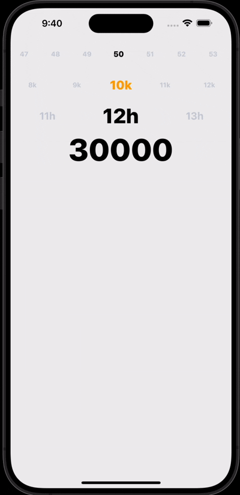

# expo-horizontal-picker
[](https://badge.fury.io/js/expo-horizontal-picker)
[](https://www.npmjs.com/package/expo-horizontal-picker)

A performant horizontal picker component for React Native and Expo apps.
- **Smooth Horizontal Scrolling**  
  Optimized with [`react-native-reanimated`](https://docs.expo.dev/versions/latest/sdk/reanimated/) for buttery-smooth, performant scroll animations.

- **Snapping Behavior**  
  Automatically snaps to the closest item to give users a precise and polished interaction.

- **Fully Customizable**  
  Style any part of the picker — container, text, selected item styles — to fit your design system.

- **Initial Index Support**  
  Set the starting index to highlight a default item.

- **Built-in Haptic Feedback Support**  
  Easily integrate with [`expo-haptics`](https://docs.expo.dev/versions/latest/sdk/haptics/) to give subtle tactile feedback when items change.

- **TypeScript Support**  
  Fully typed API for a better developer experience.

- **Works with Expo and Bare React Native**  
  Supports both managed and bare workflows out of the box.

## 📦 Installation

#### 1. Install the package
This package requires [`react-native-reanimated`](https://docs.expo.dev/versions/latest/sdk/reanimated/) to work:

```bash
npm install expo-horizontal-picker react-native-reanimated
```

Make sure to follow the additional setup instructions for Reanimated in the [official docs](https://docs.expo.dev/versions/latest/sdk/reanimated/#installation).

#### 2. (Optional) Install `expo-haptics` for haptic feedback

```bash
npm install expo-haptics
```

If you want to enable haptic feedback on item change, pass the `onHapticFeedback` prop and handle it using Expo Haptics:

## 🎬 Demo



```ts
import * as Haptics from 'expo-haptics';
import { HorizontalPicker } from 'expo-horizontal-picker';
import { SafeAreaView } from 'react-native';

export default function App() {
  return (
    <SafeAreaView style={styles.container}>
      <View>
        <HorizontalPicker
          items={Array.from({ length: 100 }, (_, i) => ({
            label: `${i + 1}`,
            value: i + 1,
          }))}
          initialIndex={49}
          visibleItemCount={7}
          onHapticFeedback={() => Haptics.impactAsync(Haptics.ImpactFeedbackStyle.Light)}
        />

        <HorizontalPicker
          items={Array.from({ length: 20 }, (_, i) => ({
            label: `${i + 1}k`,
            value: i + 1,
          }))}
          initialIndex={9}
          visibleItemCount={5}
          selectedItemTextStyle={{ color: 'orange', fontSize: 24 }}
          onHapticFeedback={() => Haptics.impactAsync(Haptics.ImpactFeedbackStyle.Rigid)}
        />

        <HorizontalPicker
          items={Array.from({ length: 24 }, (_, i) => ({
            label: `${i + 1}h`,
            value: i + 1,
          }))}
          initialIndex={11}
          visibleItemCount={3}
          itemTextStyle={{ fontSize: 20 }}
          selectedItemTextStyle={{ fontSize: 40 }}
          onHapticFeedback={() => Haptics.impactAsync(Haptics.ImpactFeedbackStyle.Heavy)}
        />

        <HorizontalPicker
          items={Array.from({ length: 5 }, (_, i) => ({
            label: `${(i + 1) * 10000}`,
            value: (i + 1) * 10000,
          }))}
          initialIndex={2}
          visibleItemCount={1}
          itemTextStyle={{ fontSize: 60 }}
          selectedItemTextStyle={{ fontSize: 60 }}
          onHapticFeedback={() => Haptics.impactAsync(Haptics.ImpactFeedbackStyle.Heavy)}
        />
      </View>
    </SafeAreaView>
  );
}

const styles = {
  container: {
    flex: 1,
    backgroundColor: '#eee',
  },
};
```

## 🧩 Props
| Prop                    | Type                                                   | Default | Description                                                                     |
|-------------------------|--------------------------------------------------------|---------|---------------------------------------------------------------------------------|
| `items`                  | `PickerOption[]`                                       | –       | Array of options to display. Each option is an object with `label` and `value`. |
| `initialIndex`          | `number`                                               | `0`     | Index of the item initially selected.                                           |
| `visibleItemCount`      | `number`                                               | `7`     | Number of items visible on screen at once.                                      |
| `onChange`              | `(value: string \| number, index: number) => void`     | –       | Callback triggered when the selected item changes.                              |
| `onHapticFeedback`      | `() => void`                                           | –       | Optional callback for haptic feedback when selection changes.                   |
| `containerStyle`        | `AnimatedScrollViewProps['style']`                     | –       | Style applied to the scroll container.                                          |
| `itemContainerStyle`    | `StyleProp<ViewStyle>`                                 | –       | Style applied to each item container.                                           |
| `itemTextStyle`         | `StyleProp<TextStyle>`                                 | –       | Style for unselected item text.                                                 |
| `selectedItemTextStyle` | `StyleProp<TextStyle>`                                 | –       | Style for selected item text.                                                   |
| ...props                | `AnimatedScrollViewProps`                              | –       | Additional props passed to `Animated.ScrollView`.                               |
